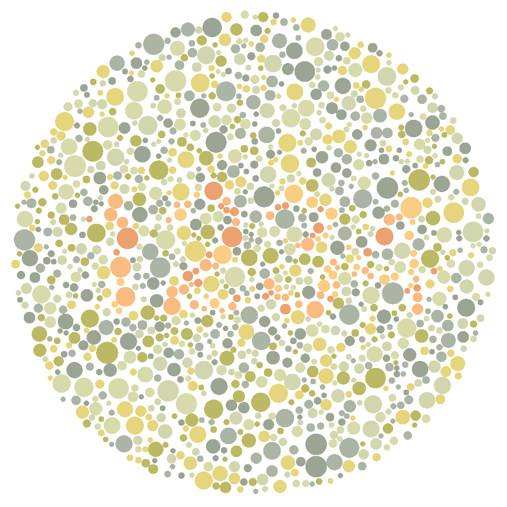

# ishihara-generator
基于NodeJS的自定义内容石原氏色盲检测图生成器

- [查看文档 (view docs)](docs/classes/IshiharaGenerator.md)

## 安装

```shell
npm i ishihara-generator.js
# or
yarn add ishihara-generator.js
# or
pnpm i ishihara-generator.js
```

## 测试

```javascript
const { IshiharaGenerator } = require('ishihara-generator.js');
(async () => {
    const [width, height] = [1024, 1024];
    const generator = new IshiharaGenerator(width, height, {
        text: '1234',
        fontSize: width / 3
    });
    await generator.generate(1500);
    await generator.save('test_output.png');
})();
```

